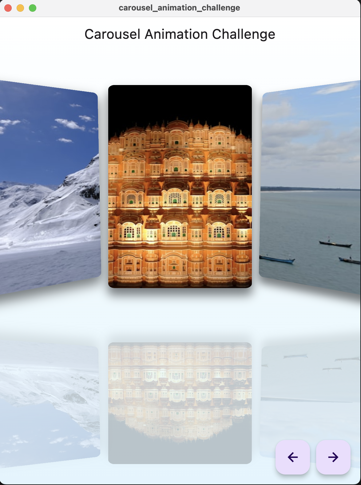

# Carousel Animation Challenge

An infinite looping carousel with various 3D transformations, shadows and mirror effect. See demo below for more details.

You can provide any widget as a carousel item. Below examples show image and text widgets as carousel items. `home_page.dart` has both methods `_simpleContent` and `_imageContent`, you can replace in code the one that you want to test in example app.

## Demo

> NOTE: Example app Carousel is currently best optimized for portrait / square aspect ratios. I'll update the example to adapt to larger screen sizes (or you can can run the app locally and test accordingly).

Demo link: https://carousel-challenge-5cbb5.web.app/

Image widget example:


Text widget example:


## Project setup

- **Prerequisites:** Flutter, Android / iOS / Web platform set up. See Flutter installation instructions to set up the platforms to run the application.

- Clone the repository.

- Run the following commands.

```bash
$ flutter packages get
$ flutter run --release

# Choose the correct platform that you want to run the app on.
```

## Project overview

Project is mainly divided into two parts:

`lib/carousel`:

- This is the core part of the carousel that implements Scrollable area, scroll physics, scroll controller and other necessary classes. This does not include any animations.
- You can directly use this widget if all you want is a barebones carousel with just scroll physics and infinite looping effects, without any 3D effects.

`lib/home_page.dart`:

- This file is responsible for the implementation of the 3D carousel you see above. It builds all the animations, shadows, mirror effects on the top of the `Carousel` widget.
- Animations are built on individual item layer instead of Carousel layer. This allows you to implement any kind of animations that suits your needs.

### Explanation for main files.

- `lib/carousel/carousel.dart`: This is the main `Carousel` widget that you would use.

- `lib/carousel/scroll_controller.dart`: It contains the `ScrollController` that is used to programatically control the carousel. It provides methods like `jumpToItem(index)`, `animateToItem(index)`, `previousItem()` and `nextItem()`.

- `lib/carousel/carousel_physics.dart`: It implements the scroll physics that Carousel uses. It is responsible to ensure that even if we do a free hand scroll, it always lands on the valid item index.

- `lib/carousel/scroll_metrics.dart`: You can listen to this class in `NotificationListener` to get the detailed snapshot of the current state of carousel. It may be useful if you want to do some side effect up the widget tree on carousel scroll.

- `lib/home_page.dart`: This contains the implementation of 3D transformation and other effects on top of `Carousel` widget.
